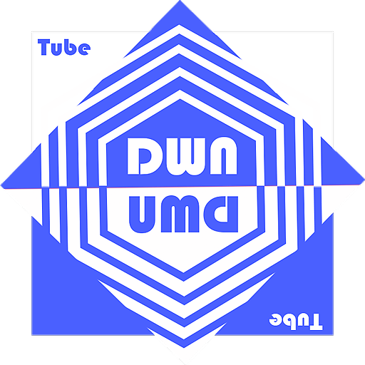

# YT-App-Downloader
[Ver Aplicacion 📱](https://yt-downloader-bc6b0.web.app/)

YT-Downloader Is a downloader that allow save videos and audio from youtube and play them after save them to the Cloud.

# You can Download:
- Video
  - 144p
  - 360p
  - 480p
  - 720p
  - 1080p 
  - enables custom resolution 
- Music
  - Music is extracted to the best audio quality

I Create this application to abolish the advertising that YouTube is currently using, thus creating an API that gives you content without advertising and allows you to take music and video everywhere

> The simplest way to make a program free is to put it in the public domain, with no rights reserved. This allows you to share the program and its enhancements with people, if they so choose. But it allows non-cooperative people to turn the program into proprietary software. They can make changes, many or few, and distribute the result as a proprietary product. People who receive the program with those modifications do not have the freedom that the original author gave them; the broker has removed them. In the GNU project, our goal is to give every user the freedom to redistribute and change GNU software. If intermediaries could take away that freedom, we would have many users, but those users would not have freedom. So instead of putting GNU software in the public domain, we protect it with Copyleft. Copyleft says that anyone who redistributes the software, with or without changes, should be free >to copy and modify it further. Copyleft guarantees that each user has freedom.

> Richard Stallman

### Tech

Dillinger uses a number of open source projects to work properly:

* [Ionic]() - Framework to PWA!
* [Nodejs]() - Concurrent server and file delivering
* [Mongodb]() - Best way to storage unrelated content.
* [Google Cloud]() - Great way to storage files and easy to implement
* [Express]() - Fast node.js network app framework
* [Firebase]() - Storage and acounts mannagment

### Link

[YT-Downloader📱](https://yt-downloader-bc6b0.web.app/)